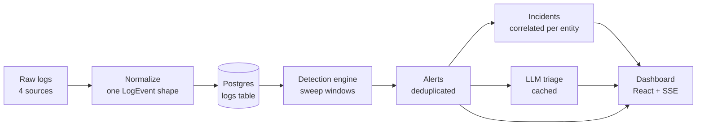
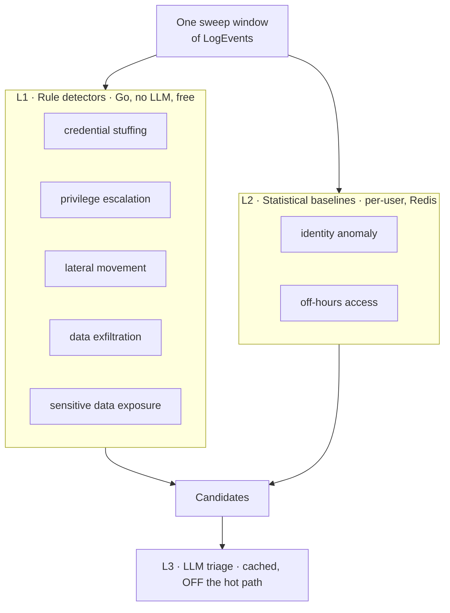
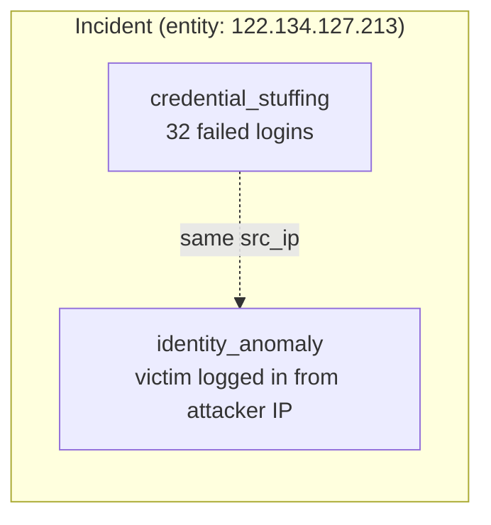
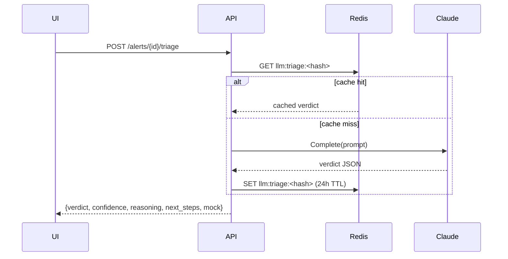
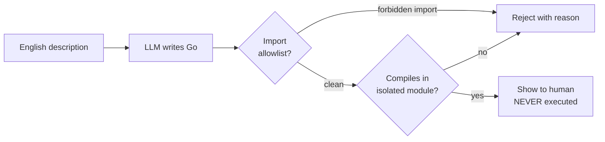
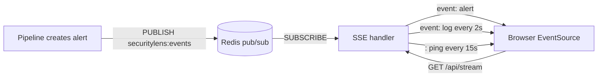
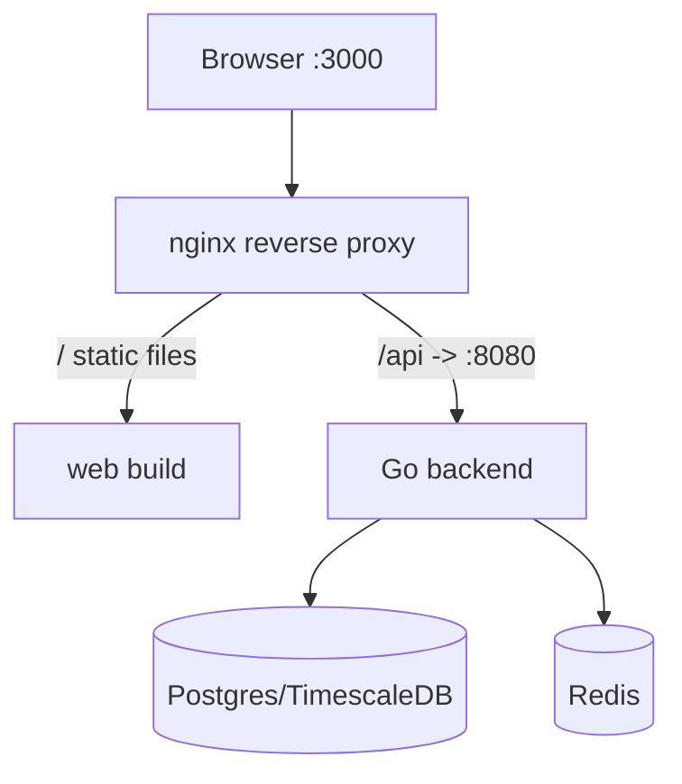
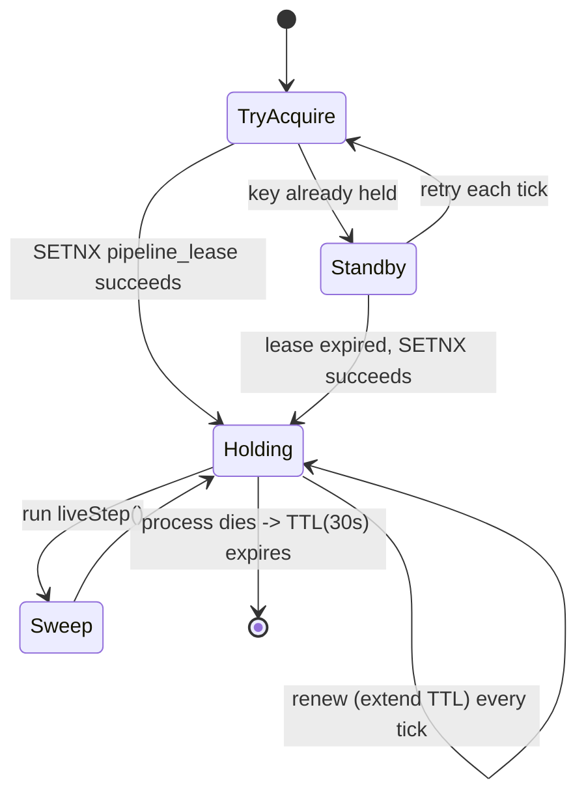

# SecurityLens — The Complete Explainer

> A ground-up walkthrough of **every concept** used to build SecurityLens: what it is,
> why it's there, how it's wired into the code, and what the whole machine does when
> you turn it on. Written to be readable by someone who has never seen the codebase.
>
> If you only read one thing, read the **[Mental Model](#1-the-mental-model-in-one-picture)**
> and the **[How Detection Actually Works](#7-the-detection-engine--the-heart-of-the-system)**
> sections. Everything else is depth.

---

## Table of contents

1. [The mental model in one picture](#1-the-mental-model-in-one-picture)
2. [What problem this solves (the threat model)](#2-what-problem-this-solves-the-threat-model)
3. [The technology stack — every piece and why](#3-the-technology-stack--every-piece-and-why)
4. [The data model — one shape for every log](#4-the-data-model--one-shape-for-every-log)
5. [Storage — Postgres/TimescaleDB and Redis](#5-storage--postgrestimescaledb-and-redis)
6. [The synthetic data generator — manufacturing a labelled world](#6-the-synthetic-data-generator--manufacturing-a-labelled-world)
7. [The detection engine — the heart of the system](#7-the-detection-engine--the-heart-of-the-system)
8. [The sweep pipeline — windows, dedup, correlation, baselines](#8-the-sweep-pipeline--windows-dedup-correlation-baselines)
9. [The label firewall — why the accuracy numbers are honest](#9-the-label-firewall--why-the-accuracy-numbers-are-honest)
10. [The evaluator — scoring against ground truth](#10-the-evaluator--scoring-against-ground-truth)
11. [The LLM layer — judgement without the hot path](#11-the-llm-layer--judgement-without-the-hot-path)
12. [Rule generation — treating the LLM as an untrusted compiler](#12-rule-generation--treating-the-llm-as-an-untrusted-compiler)
13. [The API server and Server-Sent Events](#13-the-api-server-and-server-sent-events)
14. [The React front end](#14-the-react-front-end)
15. [Deployment — Docker Compose and nginx](#15-deployment--docker-compose-and-nginx)
16. [The single-writer lease — safe concurrency](#16-the-single-writer-lease--safe-concurrency)
17. [Key algorithms, explained slowly](#17-key-algorithms-explained-slowly)
18. [Key takeaways — the lessons that generalize](#18-key-takeaways--the-lessons-that-generalize)
19. [Glossary](#19-glossary)

---

## 1. The mental model in one picture

SecurityLens is a **security operations (SecOps) platform**. It reads security logs,
decides which activity is an attack, groups related attacks into incidents, and
presents them to a human analyst with AI-assisted triage. Think of it as a small,
honest version of what a product like Splunk Enterprise Security or a SIEM
(Security Information and Event Management system) does.

The entire system is a pipeline. Data flows one direction:



Read that left to right: logs come in, get a uniform shape, land in the database,
the detection engine sweeps over them and emits **alerts**, alerts get merged into
**incidents**, an LLM adds a **verdict** to each alert, and a live dashboard shows
it all to an analyst.

The single most important design decision: **the Large Language Model (LLM) is
used only where human-like judgement helps — triage, investigation, rule writing —
and never on the per-log hot path.** Detection itself is plain, fast, deterministic
Go code. This keeps the system cheap and fast while the analyst-facing reasoning
stays rich. Almost every design choice flows from that one principle.

---

## 2. What problem this solves (the threat model)

A **threat model** is a written statement of *who the attacker is, what they can do,
and what you are trying to stop*. Without one, "security" is just vibes. SecurityLens
targets **account- and access-centric attacks** — the kind that dominate real cloud
breaches, where the attacker is using **valid or brute-forced credentials** rather
than dropping malware. This is deliberate: modern breaches are far more often "someone
logged in as you" than "someone ran a virus."

The seven concrete techniques it detects, and the detection strategy for each:

| # | Threat | What the attacker does | How SecurityLens catches it |
|---|--------|------------------------|------------------------------|
| 1 | **Credential stuffing / brute force** | Sprays many failed logins across many accounts from one source | Count failed logins per source IP over a short window |
| 2 | **Privilege escalation** | Grants themselves admin after a foothold | Detect a permission change where actor == target and the right is elevated |
| 3 | **Sensitive-data exposure** | Leaks secrets/PII into logs | A classifier that tells *real* secrets from documentation examples |
| 4 | **Identity anomaly** | Logs in successfully from a never-seen location | Per-user baseline of source IPs; flag a new **successful** origin |
| 5 | **Lateral movement** | Uses one identity to reach many hosts fast | Count distinct SSH destination hosts per user over a window |
| 6 | **Off-hours access** | Operates at the user's local deep-night | Per-user baseline of active hours; flag activity in "dead" hours |
| 7 | **Data exfiltration** | Moves a large volume of bytes outbound | Sum outbound bytes per user over a window against a threshold |

Two more parts of the threat model matter because they shaped the code:

- **Logs are untrusted, attacker-influenced input.** An attacker can put whatever
  they want into a log line. So detectors read only *operational* fields and never
  trust the content blindly (this is why the secrets classifier is careful, and why
  the labels are firewalled — see §9).
- **The LLM is treated as an untrusted code generator.** When we ask it to write a
  detection rule (§12), any Go it produces is compiled in an isolated throwaway
  module and **never executed** before a human sees it. We assume the model could
  emit something dangerous and design so that it can't do harm.

**Non-goals** (stating what you *don't* do is part of a threat model): this is not a
network intrusion detection system, not an endpoint agent, not a malware sandbox. It
reasons over structured logs, not packets or binaries.

---

## 3. The technology stack — every piece and why

Each technology was chosen for a specific reason. Understanding *why* each exists
teaches you when you'd reach for it yourself.

### Backend: Go

**Go** is a compiled, statically-typed language with first-class concurrency
(goroutines and channels). Why Go here:

- **Detectors as pure functions.** A detector is `func(window, events) []Candidate`
  — no hidden state, no side effects. Pure functions are trivially unit-testable
  against fixtures, which is exactly how the accuracy claims stay honest.
- **Speed on the hot path.** The detection engine chews through tens of thousands of
  log rows per second. Go compiles to native code and has a low-latency garbage
  collector, so this is fast without C's manual memory management.
- **Goroutines for the live pipeline.** The server runs the sweep loop in a
  background goroutine (`go p.RunLive(...)`) while serving HTTP on the main one.
  A goroutine is a lightweight thread the Go runtime schedules — cheap enough to
  spawn thousands, though here we use just a handful.

### Web framework: Gin

**Gin** is a minimal HTTP router/framework for Go. It maps URL paths to handler
functions (`api.GET("/alerts/:id", s.alert)`) and handles JSON encoding, route
parameters, and middleware (like panic recovery). It's used purely as plumbing for
the REST API — nothing exotic.

### Storage: PostgreSQL + TimescaleDB

**PostgreSQL** ("Postgres") is a relational database. Everything durable lives here:
logs, alerts, incidents, LLM usage accounting, and evaluation results.

**TimescaleDB** is a Postgres *extension* that turns an ordinary table into a
**hypertable** — a table automatically partitioned by time under the hood, which
makes time-range queries over huge log volumes fast. The clever part of the schema
(§5) is that it uses TimescaleDB *when present* and degrades gracefully to a plain
table when it isn't, with every query written to work either way.

### Cache & message bus: Redis

**Redis** is an in-memory key-value store. It plays three roles here:

1. **Per-user behavioural baselines** (which IPs a user logs in from, which hours
   they're active) — read constantly by the statistical detectors, so they must be
   fast, hence in-memory.
2. **LLM response cache** — a triage verdict for an unchanged alert is looked up by
   key instead of re-calling the model.
3. **Publish/subscribe (pub/sub) message bus** — when a new alert is created, the
   pipeline `PUBLISH`es it to a Redis channel; the SSE endpoint is `SUBSCRIBE`d and
   pushes it to the browser. Pub/sub is a messaging pattern where publishers send to
   a named channel and any number of subscribers receive it, decoupled from each
   other.
4. **Distributed lock** — the single-writer lease (§16) that stops two backend
   instances from corrupting detection.

### Frontend: React + TypeScript + Vite + TanStack Query + Recharts + Tailwind

- **React** — a UI library that builds interfaces from composable components and
  re-renders when data changes.
- **TypeScript** — JavaScript with static types. Catches mistakes at compile time and
  documents the shape of API responses.
- **Vite** — a fast build tool and dev server; it bundles the TypeScript/React into
  static files for production and proxies API calls during development.
- **TanStack Query** (formerly React Query) — manages *server state*: fetching,
  caching, refetching, and loading/error states, so components just say "give me the
  alerts" and it handles the rest.
- **Recharts** — a charting library (built on SVG) for the timeline and bar charts.
- **Tailwind CSS** — utility-class styling (`className="flex gap-3"`) so styles live
  next to markup.

### Real-time: Server-Sent Events (SSE)

**SSE** is a browser standard for the server to push a one-way stream of events to
the page over a single long-lived HTTP connection. It's simpler than WebSockets
(which are bidirectional) and perfect for a live feed that only flows server→client.
The gotcha — that a reverse proxy will buffer it and stall the feed — gets its own
section (§15).

### AI: the Anthropic Claude API

The LLM features (triage, investigation, English→Go rule generation) call **Claude**
through a **hand-rolled HTTP client** (no SDK) so you can see exactly what a Messages
API request looks like. When no API key is present, an interface-compatible **mock**
returns deterministic output of the same shape, so the whole system is fully
exercisable offline.

### Packaging: Docker Compose

**Docker** packages an app plus its dependencies into a container image that runs
identically anywhere. **Docker Compose** describes a *multi-container* app (backend,
Postgres, Redis, nginx) in one YAML file so `docker compose up` starts the whole
stack. **nginx** sits in front as a reverse proxy, serving the built front-end and
forwarding `/api` calls to the Go backend.

---

## 4. The data model — one shape for every log

The foundational idea: **normalize four different log sources into one struct.**
CloudTrail (AWS API activity), SSH auth logs, nginx access logs, and application logs
all look different on disk. Before detection, each is parsed into a single
`LogEvent` (`internal/model/model.go`):

```go
type LogEvent struct {
    ID        int64
    TS        time.Time         // when it happened (event time)
    Source    string            // cloudtrail | ssh | nginx | app
    EventType string            // console_login, api_call, ssh_login, ...
    Username  string
    SrcIP     string
    DstHost   string
    Status    string            // success | failure | denied | info
    BytesOut  int64
    Message   string
    Extra     map[string]string // source-specific extras (e.g. permission name)
}
```

Why this matters: a detector doesn't care *which* source a login came from. It cares
that `EventType == "console_login"` and `Status == "failure"`. Normalization is what
lets **one credential-stuffing detector** work across CloudTrail console logins and
SSH logins at the same time. This is the classic **"narrow waist"** design — many
inputs and many outputs, connected through one small shared shape in the middle.

The other core types:

- **`Candidate`** — a detector's raw finding *before* it's saved. Carries the alert
  type, severity, the entity it's about, an evidence bundle, and the event-time span
  of the supporting evidence.
- **`Alert`** — a persisted, deduplicated finding with a UUID, status, and an optional
  LLM `Triage`.
- **`Incident`** — a group of correlated alerts about the same entity.
- **`Evidence`** — structured support: counts, human-readable notes, and sample events.

```
  raw logs ──normalize──▶ LogEvent ──detector──▶ Candidate ──dedup/save──▶ Alert ──correlate──▶ Incident
                          (§4)                    (§7)                      (§8)                 (§8)
```

---

## 5. Storage — Postgres/TimescaleDB and Redis

### The schema (`migrations/001_init.sql`)

The schema is **idempotent** — safe to run on every boot — because it uses
`CREATE TABLE IF NOT EXISTS` everywhere. On startup the server applies every embedded
`.sql` migration in order. Key tables:

- `logs` — every normalized event, plus two ground-truth columns (`attack_id`,
  `attack_type`) that only the evaluator reads (see §9).
- `attacks` — the ground-truth manifest: one row per injected attack, with its type,
  target entity, and time span. Evaluation only.
- `alerts`, `incidents` — detection output.
- `llm_usage` — one row per LLM call for the metrics panel.
- `eval_runs` — stored evaluation results.
- `detect_state` — a tiny key/value table holding the sweep **watermark** (how far
  the live pipeline has processed).

### The graceful TimescaleDB fallback

This is a neat trick worth understanding. The migration tries to make `logs` a
hypertable, but only if the extension is installed:

```sql
DO $$
BEGIN
    IF EXISTS (SELECT 1 FROM pg_extension WHERE extname = 'timescaledb') THEN
        PERFORM public.create_hypertable('logs', 'ts', if_not_exists => TRUE, ...);
    ELSE
        RAISE NOTICE 'timescaledb extension not installed; logs remains a plain table';
    END IF;
END $$;
```

Every query in the codebase is written to work against a plain table *or* a
hypertable — they're just ordinary SQL over `ts`, `username`, `src_ip`. So the
production Docker stack gets a real time-partitioned hypertable, while local
verification on vanilla Postgres 16 uses a plain table, and the code doesn't change.
This is **progressive enhancement** applied to a database: use the better thing when
it's available, work correctly when it isn't.

### Bulk loading with COPY

Seeding loads 200,000–500,000 rows. Instead of one `INSERT` per row (slow), it uses
Postgres's `COPY` protocol via pgx's `CopyFrom`, which streams rows in a compact
binary format. Measured throughput: **~130,000 logs/sec**. `COPY` is the right tool
whenever you're loading bulk data into Postgres.

### The store layer (`internal/store/`)

**All SQL lives in one package.** This is a deliberate architectural boundary: the
rest of the code calls methods like `st.WindowEvents(start, end)` and never writes
SQL. Benefits: the label firewall (§9) is enforceable because you can see every query
in one place, and swapping storage later touches one package.

```
store.go     ─ connection pool, migrations, log I/O, timeline aggregation
alerts.go    ─ the dedup-merge upsert and incident correlation (the tricky SQL)
misc.go      ─ attacks manifest, LLM usage, eval runs, alert stats
```

### Redis's role, concretely

Redis holds only state *derived from* the dataset — never the source of truth. Keys
look like `bl:ips:alice` (a set of alice's known IPs), `bl:hrs:alice` (a hash of
hour→count), `llm:triage:<hash>` (a cached verdict), `pipeline_lease` (the lock).
Because it's all derived, a reseed can safely flush Redis and rebuild — which is
exactly what the seeder does, and forgetting it was a real bug (§18).

---

## 6. The synthetic data generator — manufacturing a labelled world

You can't measure detection accuracy without **ground truth** — knowing which events
are attacks and which are benign. Real production logs don't come labelled. So
SecurityLens generates its own world (`internal/gen/`): a fleet of ~40 users doing
realistic benign work, with attacks injected and **labelled** so the evaluator can
score against them.

### Why realism is a detection feature, not decoration

Here's the subtle insight. The easiest way to get zero false positives is to make the
benign data trivially different from attacks. That would be cheating — the detectors
would look good against a strawman. Instead, the generator deliberately creates
**plausible confusers**:

- Each user has a **timezone**, a **home IP**, sometimes an **office IP**, a small
  set of **SSH hosts they actually use**, and **working hours**. Benign logins come
  only from home/office; benign SSH touches only that user's own few hosts.
- Benign activity sits in a contiguous local-hour band with a small "evening
  shoulder" tail, so the off-hours detector faces people occasionally working late.
- The generator seeds **documentation-style secret confusers** —
  `AKIA...EXAMPLE`, `sk_test_...`, masked `token=************`, test credit-card
  numbers — so the secrets classifier must *discriminate*, not just match.
- Occasional **fat-fingered logins**: a benign failed login followed by a success,
  so credential-stuffing can't just count any failure.

The engineering payoff: false positives get eliminated **at the source** (realistic
benign data the detectors can distinguish) rather than by **raising thresholds**
(which would cost recall). That trade — fix the data model, don't blunt the
detector — is one of the biggest lessons in the project.

### The warm-up window

Attacks only begin on **day 3**. Days 0–2 are a forced **baseline warm-up**: every
user logs in from home and office and touches every working hour, so by the time an
attack happens the statistical detectors have a mature per-user baseline to judge
against. A brand-new user with no history can't be meaningfully flagged as
"anomalous," so the detectors have maturity gates (§7) and the generator respects them.

```
 day:  0        1        2    │   3        4       ...      N
       └── baseline warm-up ──┘   └──────── attacks injected ────────┘
       (home+office logins,       (7 types, each fully labelled
        every working hour)        in the `attacks` manifest)
```

### Determinism

The generator is seeded by a single integer (`SEED_SEED`). The same seed produces a
**byte-identical** dataset every run. This is what makes the accuracy numbers
*reproducible* — `make seed && make eval` gives the same table every time. The one
exception is an "anchor to now" mode used by the live server so the dashboard feed
has fresh events; evaluation always uses the fixed anchor.

### The two halves

- `gen.go` — the fleet, the benign activity, the event constructors.
- `attacks.go` — one attack of every type (plus scale-dependent extras), each written
  into both the `logs` (with labels) and the `attacks` manifest.

---

## 7. The detection engine — the heart of the system

This is where the actual security work happens. The engine is **three layers**,
labelled L1/L2/L3 in the architecture:



Note the ordering: **L1 and L2 run on every window; L3 is not part of detection at
all** — the LLM only ever sees an alert *after* it exists, on demand, cached. That
placement is the whole cost/latency argument of the system.

### The detector interface

Every detector implements one tiny interface:

```go
type Detector interface {
    Name() string
    Detect(w Window, events []model.LogEvent, bl *BaselineView) []model.Candidate
}
```

It takes a window of events (and, for statistical detectors, a read-only view of the
baselines) and returns candidates. No I/O, no shared mutable state. That purity is
why `internal/detect/rules_test.go` can test each detector against hand-built fixtures.

### The one insight that took precision from ~50% to 100%

**Behavioural detectors must ignore failed and denied events.** Here's why it matters
so much. A credential-stuffing burst lands *failed* logins on dozens of victims at
one instant. Naively:

- The **off-hours** detector sees a failed login for a victim whose timezone makes
  that instant local 3am → flags "off-hours access" on an innocent victim.
- The **identity** detector sees a login attempt from the attacker's new IP → flags
  "new location" on the victim.

Every victim of one stuffing burst becomes a false positive. The fix, encoded in
`isSuccessfulAccess()`:

```go
func isSuccessfulAccess(e model.LogEvent) bool {
    if e.Status != model.StatusSuccess { return false }
    switch e.EventType {
    case EvConsoleLogin, EvAPICall, EvSSHLogin: return true
    }
    return false
}
```

Off-hours counts only successful *access*. Identity requires a *successful* auth from
the new origin. Baselines learn only from successes (so a stuffing burst can't
whitelist the attacker's IP before the breakthrough). This single principle is the
difference between ~50% and 100% operational precision.

### The seven detectors in detail

**L1 — Rule detectors** (`rules.go`, `secrets.go`) are deterministic thresholds over
one window:

| Detector | Logic | Default threshold |
|----------|-------|-------------------|
| Credential stuffing | Failed logins per source IP, hitting many distinct accounts | ≥12 failures **and** ≥5 distinct users |
| Privilege escalation | Successful permission change where actor == target and the right is elevated (`admin`, `root`, `*`, ...) | any |
| Lateral movement | Distinct SSH destination hosts per user (successful only) | ≥6 hosts |
| Data exfiltration | Sum of outbound bytes per user | ≥150 MB |
| Sensitive-data exposure | Live secrets found in log messages (see classifier below) | any real secret |

**L2 — Statistical detectors** (`stats.go`) compare against a learned per-user
baseline:

| Detector | Logic | Maturity gate |
|----------|-------|---------------|
| Identity anomaly | Successful console login from an IP not in the user's baseline IP set | ≥5 prior successful logins |
| Off-hours access | Successful access in a UTC hour where the baseline **and both neighbours** are empty | ≥40 events across ≥3 days |

The **maturity gate** stops a brand-new user's first-ever evening event from
self-reporting as anomalous. The off-hours **dead-band** (the hour *and* its
neighbours must all be empty) separates true deep-night access from someone working
one hour past their normal band.

### The secrets classifier — discrimination, not matching

`SensitiveDataExposure` (`secrets.go`) is the most interesting detector because the
naive version is trivially wrong. Matching "a secret-shaped string" flags every
masked `token=************` in a log. The classifier instead runs a **positive/negative
gate**:

```
For each candidate secret found by regex:
  reject if it contains a placeholder marker (example, <redacted>, xxxx, ****, ...)
  reject if it's uniform/short (all same char, < 6 chars)
  require live secrets to mix character classes (looks like real key material)
  Luhn-check credit-card numbers and drop known test cards
  reject reserved SSN ranges (000-, 666-, 900+, the 123-45-6789 example)
```

Its full false-positive/true-positive table is a committed unit test
(`secrets_test.go`), and any alert it raises has the secret **redacted** in the
evidence so the alert itself doesn't re-leak it.

### The window-overlap trick for recall

A **count-threshold detector** has a boundary problem: a burst that straddles the
edge of a time window can split below threshold on *both* sides and be missed. The
fix (details in §8 and §17): make successive windows **overlap** so any burst shorter
than the step is fully contained in at least one window, then deduplicate the
resulting double-fires. This gives robust 100% recall **without lowering thresholds**.

---

## 8. The sweep pipeline — windows, dedup, correlation, baselines

The pipeline (`internal/pipeline/pipeline.go`) is the conductor. It sweeps
**event-time windows** out of Postgres, fans each window to every detector, turns
candidates into deduplicated alerts, correlates alerts into incidents, and updates
the baselines.

### Event time vs. wall-clock time

A crucial distinction. **Event time** is *when the log says the event happened*.
**Wall-clock time** is *now*. The pipeline sweeps by event time — it processes the
window `[t, t+2·step)` of events regardless of when those rows were inserted. This is
what lets the same code do a **backfill drain** (process a whole historical dataset
at once, for evaluation) and **live detection** (process each window as it settles).

### The window geometry

```
step = 10 min (SWEEP_STEP).  Each window is 2·step = 20 min long, advancing by step.

  window A:  [00:00 ──────── 00:20)
  window B:          [00:10 ──────── 00:30)
  window C:                  [00:20 ──────── 00:40)
                     └ 10-min overlap ┘

A burst anywhere shorter than 10 min is fully inside at least one window.
```

Each `sweep(t)`:

1. Loads events in `[t, t+2·step)` from Postgres.
2. Runs every detector over them, producing candidates.
3. Upserts each candidate into an alert (dedup-merge, below).
4. Correlates the alert into an incident.
5. **Then** updates the baselines with only the *leading step* `[t, t+step)` — so
   every event is learned exactly once even though windows overlap, and detection
   always runs *before* an event is added to the baseline (so an attack's own events
   can never vouch for themselves).

### Deduplication by event-time key

Overlapping windows fire the same burst more than once. `UpsertAlert`
(`store/alerts.go`) merges them: a candidate whose evidence span overlaps (within a
15-minute pad) an existing alert *of the same type on the same entity* merges into it
instead of creating a duplicate. The dedup is by **event time**, not arrival time, so
it's stable — running the same drain twice produces the exact same alert count (this
is an assertion in the integration test).

### Entity correlation into incidents

`CorrelateAlert` groups alerts about the same **entity** (username or source IP)
within a time gap into one **incident**. The clever bit: an incident matches if its
entity equals the alert's entity, username, *or* source IP. So a stuffing incident
keyed on the attacker IP also absorbs the identity-anomaly alert raised on the
breached victim account — because that alert carries the attacker IP in its `src_ip`.
This mirrors how a real SOC correlates: one attack, one incident, even though several
detectors fired.



### Backfill drain vs. live run

- **`Drain`** — used by the evaluator and the integration test. Resets baselines,
  then sweeps every window from the earliest to the latest log. Deterministic.
- **`RunLive`** — used by the server. On a ticker (every `SWEEP_INTERVAL`), it sweeps
  every window that has *settled* (is far enough in the past, by `DETECT_LAG`, that no
  more events will arrive for it). It persists a **watermark** so a restart resumes
  where it left off. Detection latency is therefore bounded by
  `SWEEP_INTERVAL + DETECT_LAG` — about 20 seconds with the defaults.

The beautiful property: **live detection and batch evaluation run the identical
`sweep()` code**, so the live dashboard reproduces the evaluator's numbers exactly.

---

## 9. The label firewall — why the accuracy numbers are honest

This is the single most important integrity mechanism in the project.

The dataset carries ground-truth labels (`logs.attack_id`, `logs.attack_type`, and the
`attacks` manifest) so the evaluator can score detections. But if a detector could
*read those labels*, it could "detect" attacks by peeking at the answer key — and the
reported accuracy would be a lie.

The **label firewall** is the invariant: **no detector code may reference the label
columns.** Concretely, the string `attack_` must not appear anywhere under
`internal/detect/`. It's enforced by a check that fails the build if violated:

```makefile
check-label-firewall:
	@! grep -rn "attack_" internal/detect/ || (echo "FAIL: label referenced"; exit 1)
	@echo "label firewall OK: no attack_ reference under internal/detect/"
```

The `store.WindowEvents` query that feeds detection deliberately selects only
operational columns — never `attack_id`/`attack_type`. Only `cmd/eval`,
`internal/eval`, and tests are allowed to read labels. This guarantees the accuracy
reflects detection on **operational fields the way production would see them**, not
label leakage. A metric you can't trust is worse than no metric; this check is what
makes the numbers trustworthy.

```
   ┌─────────────────────────────┐         ┌──────────────────────┐
   │ logs table                  │         │  ALLOWED to read labels │
   │  operational cols ──────────┼────────▶│  cmd/eval, internal/eval │
   │  attack_id, attack_type ────┼──╳──┐   │  tests                   │
   └─────────────────────────────┘     │   └──────────────────────┘
                                        │
                                   FIREWALL: internal/detect/ may never
                                   reference attack_*  (enforced by make target)
```

---

## 10. The evaluator — scoring against ground truth

`cmd/eval` + `internal/eval` drain the pipeline over a labelled dataset and score
every alert against the `attacks` manifest. It computes recall and **two** precision
numbers, and the reason there are two is genuinely important.

### The two precision numbers

- **Operational precision** counts an alert as correct if it overlaps a real attack
  on the **same entity**, *regardless of which detector fired*. This mirrors how a
  multi-detector SOC with correlation actually triages: an alert pointing at genuine
  attack activity is useful even if a "different" detector owned that technique.
  SecurityLens hits **100%** — zero alerts on benign activity.
- **Type-exact precision** *additionally* requires the detector's label to match the
  ground-truth label. It sits at 73–89% because the *same* malicious activity
  legitimately trips more than one detector — a credential-stuffing breakthrough that
  succeeds also reads as an identity anomaly *and* an off-hours event (the attacker
  logs in from a new IP at the victim's odd local hour). Correlation merges these into
  one incident. **These are overlapping true detections, not false alarms**, which is
  why they cost type-exact but not operational precision.

Reporting both, and explaining the gap, is more honest than cherry-picking the
flattering one.

### Scoring logic

For each attack: is there a same-type alert on the same entity overlapping in time
(within a pad)? → recall. For each alert: does it overlap a same-type attack (exact
TP), a different-type attack (cross-type TP), or nothing (benign false positive)? The
`entityMatches` helper checks entity/username/src_ip so a stuffing attack keyed on the
attacker IP is matched by an identity alert that carries that IP.

### The measured results

| Dataset | Recall | Operational precision | Type-exact | Benign FPs |
|---------|--------|----------------------|-----------|------------|
| 8k / 10d / seed 7 | 100% | 100% | 89% | 0 |
| 20k / 14d / seed 1 | 100% | 100% | 73% | 0 |
| 200k / 21d / seed 1 | 100% | 100% | 76% | 0 |
| 200k / 21d / seed 3 | 100% | 100% | 76% | 0 |
| 500k / 30d / seed 42 | 100% | 100% | 88% | 0 |

All seven attack types detected in every run, across dataset sizes spanning ~60×.

---

## 11. The LLM layer — judgement without the hot path

The LLM (`internal/llm/`) does three things, each requiring human-like judgement:
**triage** (is this alert a real threat, and what next?), **investigation** (form a
hypothesis over the surrounding activity), and **rule generation** (§12). It is
*never* called per log.

### One interface, two implementations

```go
type Client interface {
    Complete(ctx, Request) (Response, error)
    Live() bool
    ModelName() string
}
```

- **`Anthropic`** (`anthropic.go`) — a hand-rolled HTTP client for the Claude Messages
  API. Sends `x-api-key`, `anthropic-version`, and a JSON body with `model`,
  `max_tokens`, `messages`, and `thinking: {type: "adaptive"}`. It checks
  `stop_reason` for a refusal *before* reading content, and retries 429/5xx with
  exponential backoff. Writing it by hand (instead of an SDK) makes the exact API
  shape visible and dependency-free.
- **`Mock`** (`mock.go`) — returns deterministic output of the *same JSON shape*,
  derived from a hash of the request. So with no API key, every LLM feature and every
  UI state still works, repeatably, offline. The mock is not a stub — its output flows
  through the *exact same parsing path* as live output, including a brace-balanced
  JSON extractor that tolerates prose or code-fence wrapping.

Which path produced a result is always tagged `mock: true|false` in the API and UI, so
you never confuse a demo answer for a real one.

### Caching and accounting

`Service` (`service.go`) wraps the client with the Redis cache and the `llm_usage`
table. A triage request builds a cache key from the alert's identity and evidence
hash — so re-requesting triage for an unchanged alert is a free cache hit. Every call
(or cache hit) is recorded for the metrics panel: feature, model, mock-vs-live,
tokens, latency.



---

## 12. Rule generation — treating the LLM as an untrusted compiler

The threat-hunting assistant includes an **English→Go rule generator**: an analyst
types "flag users with more than 5 denied API calls," the LLM writes a Go `Detect`
function, and the system validates it. The security-critical design: **the generated
code is never executed**, and it's checked in two layers before a human sees it
(`internal/rulegen/validate.go`):

1. **Import allowlist (static analysis).** The code is parsed (`go/parser`) and its
   imports checked against a pure-computation allowlist (`fmt`, `strings`, `strconv`,
   `time`, `regexp`, `sort`, `math`, ...). Anything touching `os`, `os/exec`, or the
   network is **rejected before the compiler runs**. A "detection rule" has no
   business exec-ing binaries.
2. **Isolated compile.** Whatever passes is written into a throwaway module and
   compiled with `go build` under `GOPROXY=off` (no network), in a temp dir that's
   deleted afterward. Only the compiler's verdict (ok / error text) is returned.

A unit test proves an `os`-importing rule is rejected, and that a rule with a
side-effecting initializer *compiles but never runs* (it checks a sentinel file is
never created). This is the concrete expression of "the LLM is an untrusted code
generator" from the threat model.



---

## 13. The API server and Server-Sent Events

The HTTP surface (`internal/api/api.go`) is a set of REST endpoints plus one SSE
stream. Highlights:

- `GET /api/health` — DB/Redis/LLM status.
- `GET /api/alerts`, `GET /api/alerts/:id` (with runbook), `POST .../triage`,
  `POST .../investigate`, `POST .../status`.
- `GET /api/incidents`, `GET /api/incidents/:id`.
- `POST /api/rules/generate` — the rule generator.
- `GET /api/metrics` — alert volume, FP rate, LLM usage, latency bound.
- `GET /api/oncall` — the JSON payload a pager integration would receive.
- `GET /api/stream` — the SSE live feed.

### How the live feed works



The SSE handler sets `Content-Type: text/event-stream`, subscribes to the Redis
channel, and in a loop: forwards published alert events immediately, tails new log
rows every 2 seconds, and sends a heartbeat comment every 15 seconds to keep the
connection alive. Critically it sets `X-Accel-Buffering: no` so nginx won't buffer the
stream (see §15).

---

## 14. The React front end

The dashboard (`web/src/`) is a single-page app with five tabs (`App.tsx`):

| Tab | Component | Shows |
|-----|-----------|-------|
| Overview | `Overview.tsx` | Live SSE feed + activity timeline |
| Alerts | `Alerts.tsx` | Alert list → detail with evidence, LLM triage, runbook |
| Incidents | `Incidents.tsx` | Correlated incidents and their alerts |
| Hunt | `Hunt.tsx` | Investigation + the English→Go rule generator |
| Metrics | `Metrics.tsx` | Accuracy panel, alert volume, LLM usage |

- **`api.ts`** — one typed module wrapping every backend endpoint and the SSE
  connection, so components never build URLs by hand.
- **TanStack Query** handles fetching/caching/refetch; a component just calls
  `useQuery({ queryKey, queryFn })` and gets `data`/`loading`/`error`.
- **`charts.tsx`** — Recharts timeline and bar charts. A real bug lived here: Recharts
  writes colors into SVG `fill` attributes where CSS `var(--...)` doesn't resolve, so
  charts use *resolved hex* while the surrounding UI keeps CSS variables. Caught by a
  headless-browser pass that counted rendered bars (§18).
- Every LLM result shows a **mock/live tag** so the provenance is always visible.

The build (`vite build`) emits static files that nginx serves; the Go server can also
serve them directly in native mode.

---

## 15. Deployment — Docker Compose and nginx

`docker-compose.yml` describes four services that start with one command:



- **Postgres/TimescaleDB** — the `timescale/timescaledb` image, so production gets a
  real hypertable.
- **Redis** — cache, pub/sub, lease.
- **backend** — the Go server; on first boot it seeds the dataset and starts detecting.
- **web + nginx** — the built front end served by nginx, which reverse-proxies `/api`
  to the backend.

### The SSE-and-nginx gotcha

By default nginx **buffers** proxied responses — it waits to accumulate a chunk before
forwarding. For a normal request that's fine. For SSE it's fatal: the live feed would
sit in nginx's buffer and never reach the browser until the connection closed. The
fix, in `nginx.conf`, is `proxy_buffering off` on the `/api/stream` location (and the
backend already sends `X-Accel-Buffering: no`). This was verified for real: an alert
published mid-stream arrived at the client immediately instead of on connection close.

> **Note on this environment:** the Compose stack, Dockerfiles, and nginx config are
> authored and self-consistent, and the nginx config passes a real `nginx -t`, but the
> sandbox this was built in has no container runtime (no root to install one), so the
> images were not built here. Everything was instead verified *natively* — Go build,
> vet, full unit + integration tests, a live server smoke test, and the front-end
> production build. The README states this plainly.

---

## 16. The single-writer lease — safe concurrency

The live pipeline keeps **per-user baselines** in memory with write-through to Redis.
If two backend instances ran against the same database, they'd *race* on that shared
state — each mutating Redis while holding its own in-memory copy — and emit spurious
alerts during the warm-up period. (This actually happened during development, when two
server instances overlapped; it produced a burst of phantom identity/off-hours
false positives on the warm-up days. The lesson: don't mutate a running pipeline's
state from two writers.)

The fix is a **single-writer lease** — a distributed lock in Redis. Only the instance
holding `pipeline_lease` sweeps; the other stands by:



The lease has a 30-second TTL and is renewed every tick (15s) via a compare-and-extend
(only the owner renews). If the holder dies, the key expires and the standby acquires
it — **automatic failover**. This was verified by running two instances (only one
swept; detection stayed clean at 17 alerts / 0 false positives) and then killing the
holder (the standby took over within the TTL, detection intact). It's an honest
mitigation for a single-node design, not full horizontal scale-out.

---

## 17. Key algorithms, explained slowly

### Window overlap + event-time dedup (recall without lowering thresholds)

The problem: a count-threshold detector needs, say, ≥12 failures in a window. A burst
of 20 failures split 8/12 across a boundary fails on the low side.

The solution has two parts:

1. **Overlap.** Windows are `2·step` long but advance by `step`, so consecutive
   windows overlap by `step`. Any burst shorter than `step` is *fully contained* in at
   least one window.
2. **Dedup.** Because the burst is now seen by two overlapping windows, it would fire
   twice. The event-time dedup merges same-type/same-entity findings whose evidence
   spans overlap, collapsing the double-fire into one alert.

Together: recall goes to 100% *without* lowering the threshold (which would have
created false positives).

### Baseline learning from successes, updated after detection

```
for each sweep(t):
    detect over [t, t+2·step)         # judge events against baseline-so-far
    update baseline with [t, t+step)   # then learn, from successes only, once
```

Two invariants fall out: (a) an attack's own events never enter the baseline before
they're judged (no self-vouching), and (b) each event is learned exactly once despite
overlap. And learning **only from successes** means a stuffing burst's failed logins
can't add the attacker's IP to a victim's known-IP set.

### The Luhn check (credit-card validation in the secrets classifier)

Real credit-card numbers satisfy the **Luhn checksum** (double every second digit from
the right, sum, must be divisible by 10). The classifier Luhn-checks candidate card
numbers and drops known test cards (like `4111 1111 1111 1111`). This is how it tells a
real leaked card from a documentation example — pure arithmetic, no LLM.

### Compare-and-extend lease renewal

The lease renewal is a tiny distributed-systems pattern: `GET` the key, and only `SET`
(extend the TTL) if the value is still *your* owner ID. This prevents a paused instance
from stealing back a lease that a standby has already legitimately taken over.

---

## 18. Key takeaways — the lessons that generalize

These are the transferable lessons, the things worth carrying to the next system.

1. **Put the expensive/smart component off the hot path.** The LLM adds judgement
   where it helps (triage, hunting) and is cached and never per-log. Detection stays
   fast, cheap, deterministic. *Use the powerful tool sparingly and precisely.*

2. **Fix false positives at the data model, not with thresholds.** Making the benign
   data realistic (home IPs in baseline, per-user host sets, timezone-aware hours)
   eliminated whole classes of false positive at the source. Raising thresholds would
   have cost recall. *When something misfires, ask whether the model of "normal" is
   wrong before you blunt the detector.*

3. **The dominant false-positive source was one insight.** Behavioural detectors
   ignoring failed/denied events took operational precision from ~50% to 100%.
   *One correct observation about your data can be worth more than a dozen tuning
   knobs.*

4. **Measure honestly or don't measure.** The label firewall makes "100% recall" mean
   something. Two precision numbers, with the gap explained, beat one flattering one.
   *An accuracy number you can't defend is a liability.*

5. **Determinism is a feature.** A seeded generator makes results reproducible;
   reproducibility makes tuning a science instead of guesswork (change one thing,
   re-run, read the number).

6. **Design for the untrusted component.** Both logs and the LLM's code output are
   treated as hostile. Generated rules are statically screened and compiled in
   isolation, never executed. *Assume the input can be malicious and make it safe by
   construction.*

7. **Progressive enhancement over hard dependencies.** TimescaleDB when present, plain
   table when not; live LLM with a key, deterministic mock without. The system is
   fully functional in the degraded case. *Don't let a nice-to-have become a
   can't-run-without.*

8. **The same code should serve batch and live.** `sweep()` powers both the evaluator
   and the live pipeline, so the dashboard's numbers *are* the evaluated numbers.
   *Shared core logic means your tests actually test production.*

9. **Real verification catches real bugs.** Running it for real surfaced things
   inspection never would: reseeding must flush Redis; two writers corrupt baselines
   (→ the lease); Recharts ignores CSS variables in `fill`; nginx buffers SSE. *You
   only know it works when you've run the thing and read the output.*

10. **Operational hygiene is part of correctness.** A scary 44-alert run turned out to
    be two overlapping server instances mutating the same tables — an operational
    artifact, not a code bug. *When results look wrong, check how you ran it before you
    blame the code.*

---

## 19. Glossary

| Term | Meaning |
|------|---------|
| **SIEM** | Security Information and Event Management — a system that centralizes logs and detects/alerts on security events. SecurityLens is a compact one. |
| **SOC** | Security Operations Center — the team/room of analysts who work alerts. |
| **Threat model** | A written statement of who the attacker is, what they can do, and what you're defending against. |
| **Ground truth** | The known-correct labels (which events are attacks) used to score detection. |
| **Recall** | Of all real attacks, the fraction you detected. Misses hurt recall. |
| **Precision** | Of all alerts you raised, the fraction that were real. False alarms hurt precision. |
| **False positive (FP)** | An alert on benign activity. |
| **Baseline** | A learned model of a user's normal behaviour (which IPs, which hours). |
| **Event time vs. wall-clock time** | When the log says it happened vs. now. The pipeline sweeps by event time. |
| **Watermark** | A saved marker of how far the live pipeline has processed, so restarts resume. |
| **Dedup (deduplication)** | Merging repeated findings of the same thing into one alert. |
| **Correlation** | Grouping related alerts (same entity, near in time) into one incident. |
| **Hypertable** | A TimescaleDB table auto-partitioned by time for fast time-range queries. |
| **COPY** | Postgres's fast bulk-load protocol. |
| **Pub/sub** | Publish/subscribe messaging: publishers send to a channel, subscribers receive, decoupled. |
| **SSE** | Server-Sent Events — a one-way server→browser event stream over HTTP. |
| **Reverse proxy** | A server (nginx) that fronts your app, serving static files and forwarding API calls. |
| **Idempotent** | Safe to run multiple times with the same effect (like the migrations). |
| **Goroutine** | A lightweight concurrent task in Go. |
| **Lease / distributed lock** | A time-limited claim on a shared resource, held in Redis here, so only one writer acts. |
| **Luhn checksum** | The arithmetic check that validates credit-card numbers. |
| **Maturity gate** | A rule that suppresses a statistical alert until enough history exists to judge. |
| **Dead-band** | The off-hours rule that an hour *and its neighbours* must all be empty before flagging. |
| **Label firewall** | The enforced rule that detector code never reads ground-truth labels. |
| **Hot path** | The performance-critical code run on every item (here, per log). The LLM is kept off it. |

---

*Every claim in this document is backed by code in this repository. Start with
`internal/detect/` for the detection logic, `internal/pipeline/pipeline.go` for the
sweep, `internal/eval/` for the scoring, and `cmd/` for the entry points. The README
has the run instructions and measured numbers; NOTES.md has the chronological tuning
history.*
